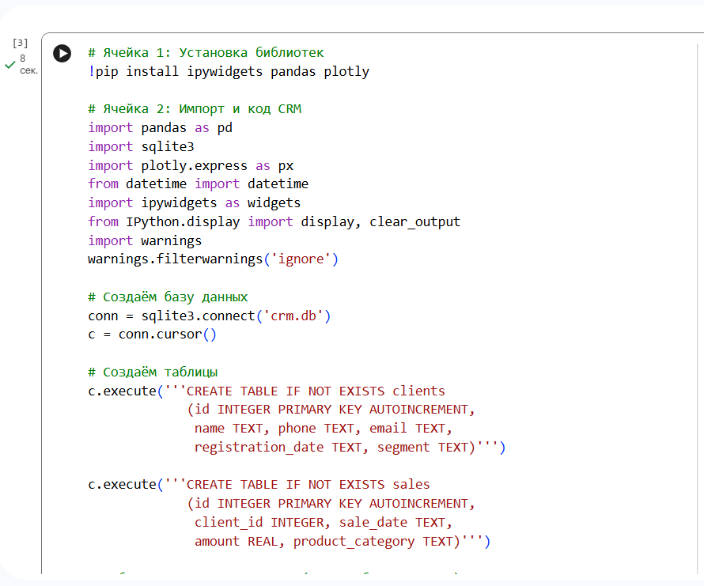
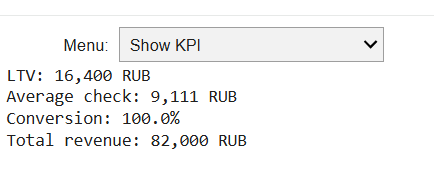
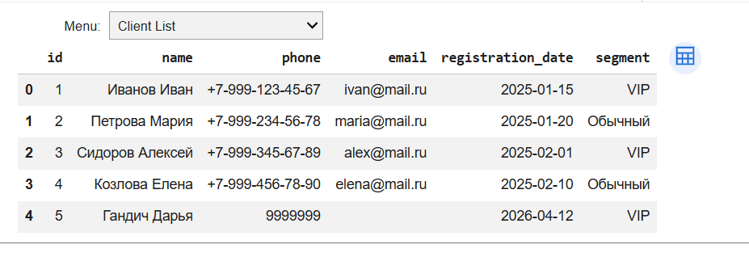
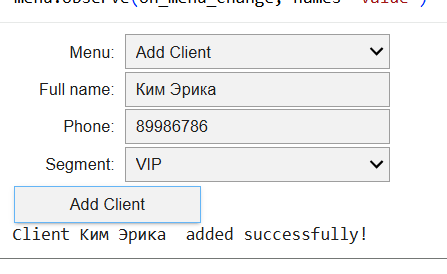
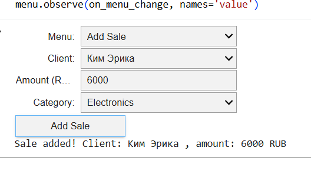
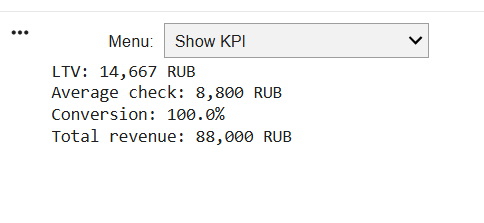

# Прототип CRM-системы для оптимизации продаж в ритейле

## Описание проекта
Разработан прототип CRM-системы для розничной торговли, реализующий ключевой функционал для оптимизации процесса продаж.

## Реализованный функционал
- Управление клиентской базой (добавление, просмотр)
- Учёт продаж по категориям товаров
- Автоматический расчёт KPI (LTV, средний чек, конверсия, общая выручка)
- Визуализация продаж по категориям (график Plotly)
- Хранение данных в SQLite

## Технологии
- Python 3.9+
- Google Colab
- SQLite
- Pandas
- Plotly
- ipywidgets

## Запуск прототипа
1. Открыть Google Colab (colab.research.google.com)
2. Загрузить файл crm_prototype.ipynb
3. Запустить все ячейки (Runtime -> Run all)
4. Работать с системой через выпадающее меню

## Результаты тестирования

### Скриншоты работы системы

**1. Главное меню**

**2. Дашборд KPI (до добавления данных)**

**3. Список клиентов**

**4. Добавление нового клиента**

**5. Добавление продажи**

**6. Дашборд KPI (после добавления данных)**

### Логи работы
